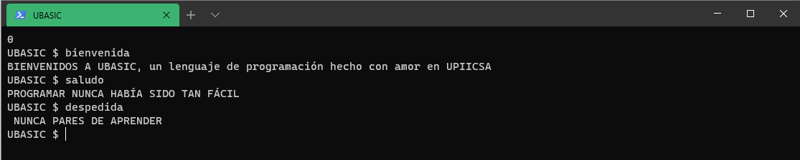

 
  

# ¿Qué es UBASIC?

Es un lenguaje de programación creado en Python, inspirado en lenguaje BASIC y C, desarrollado por alumnos de UPIICSA para todo aquel que quiera aprender y reforzar sus conocimientos en le amplio mundo de la programación.

UBASIC esta inspirado para todas aquellas que quieran involucrase en el mundo de la programación y que no tengan los fundamentos del idioma inglés.

Además, UBASIC busca fortalecer las áreas de educación y emprendimiento en niveles básicos y avanzados para todos aquellos que buscan un plus en su trayecto profesional.

 
  

## ¿Un lenguaje de programación más?

La respuesta es NO, UBASIC busca estar al nivel lenguajes de programación populares como JAVA, C++, entre otros. 

UBASIC es diferente a los demás lenguajes, lleva su esencia el alma mater de México y sus desarrolles, como su único objetivo mejorar el nivel educativo de cualquier institución dedicada a las tecnologías.

### ¿Qué ofrece UBASIC?

Permite al usuario el confort de generar código limpio, sencillo y de fácil comprensión y redacción.

Tan fácil como redactar una tarea o mensaje, su sintaxis autónoma y didáctica permite al usuario comprender el código generado sin necesidad de conocimientos previos de programación.

