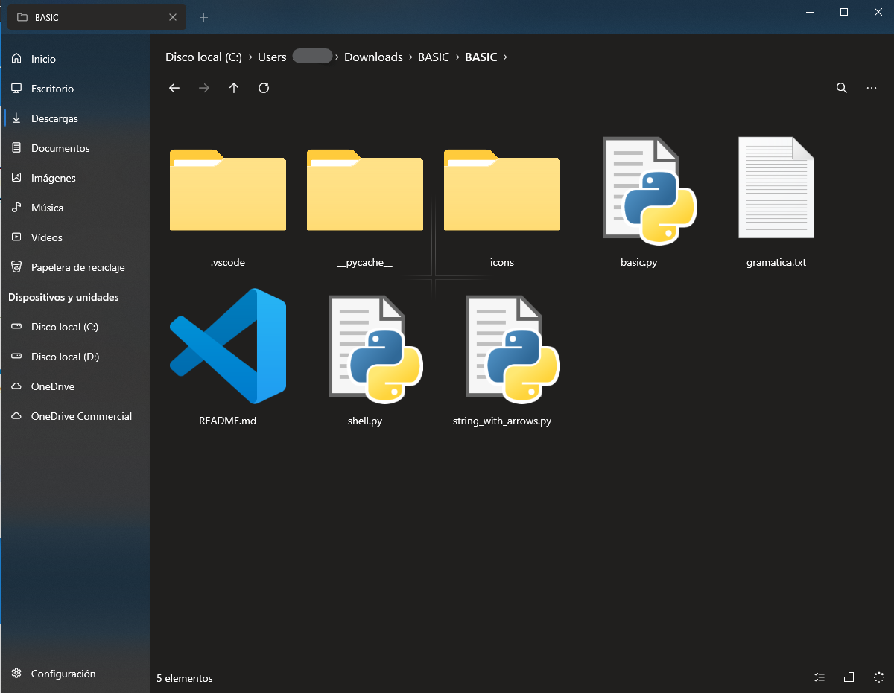

 
  

# ¿Qué es UBASIC?

Es un lenguaje de programación creado en Python, inspirado en lenguaje BASIC y C, desarrollado por alumnos de UPIICSA para todo aquel que quiera aprender y reforzar sus conocimientos en le amplio mundo de la programación.

UBASIC esta inspirado para todas aquellas que quieran involucrase en el mundo de la programación y que no tengan los fundamentos del idioma inglés.

Además, UBASIC busca fortalecer las áreas de educación y emprendimiento en niveles básicos y avanzados para todos aquellos que buscan un plus en su trayecto profesional.

 
  

## ¿Un lenguaje de programación más?

La respuesta es NO, UBASIC busca estar al nivel lenguajes de programación populares como JAVA, C++, entre otros. 

UBASIC es diferente a los demás lenguajes, lleva su esencia el alma mater de México y sus desarrolles, como su único objetivo mejorar el nivel educativo de cualquier institución dedicada a las tecnologías.

### ¿Qué ofrece UBASIC?

Permite al usuario el confort de generar código limpio, sencillo y de fácil comprensión y redacción.

Tan fácil como redactar una tarea o mensaje, su sintaxis autónoma y didáctica permite al usuario comprender el código generado sin necesidad de conocimientos previos de programación.

### ¿Qué contiene UBASIC?
UBISC contiene diversos archivos, entre ellos:
- **SHELL.py** - La consola personalizada para programar e interactuar con el lenguaje.
- **BASIC.PY** – código fuente del lenguaje de programación.
- **STRING_WITH_ARROWS.py** – Visualiza en la SHELL los errores subrayados
- **__PYCACHE__** - carpeta que almacena el cache de los errores que llegasen a surgir en tiempo de compilación

 
  

#### Palabras reservadas de UBASIC
- IMPRIMIR() – imprime en consola la cadena de caracteres
- LIMPIAR() – función para limpiar la consola de comandos de UBASIC
- VAR – palabra reservada para declarar una variable (sea entero, flotante o cadena de caracteres)
- FUN – permite inicializar una función
- MATH_PI – añade la constante PI para operaciones aritméticas
- Y – función AND para operaciones lógicas
- O – función OR para operaciones lógicas
- NO – función NOT (negación) para operaciones lógicas
- AÑADIR – permite agregar valores a una lista
- AGRUPAR – permite fusionar dos o más listas
- PARA – declaración de la condición FOR
- SI – declaración de la condición IF
- HASTA – declaración de la condición IF 
- MIENTRAS – declaración de condición WHILE
- DE – contador para condicionales
- ES_NUM - declaración para un numero entero
- ES_CAR – declaración para una cadena de caracteres

**Para mayor contenido intelectual sobre el lenguaje, toma el curso en UDEMY *“UBASIC un lenguaje diferente”***
